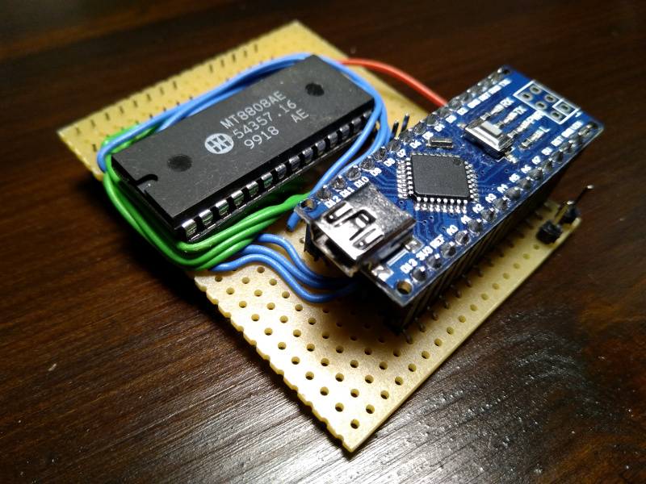
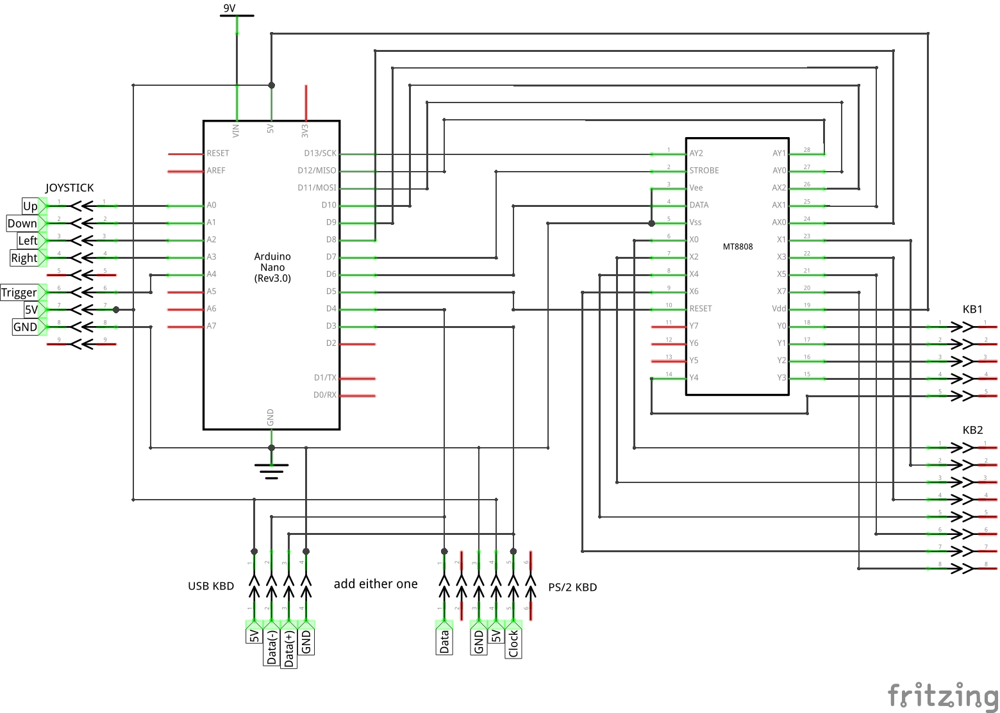

# spectratur

#### *keyboard actuator for vintage computers*

## TL;DR
*spectratur* was originally developed for sending keyboard input from a PC to a *Sinclair ZX Spectrum*, hence the name - *Spectrum* + *Tastatur* (German for keyboard). But it can be easily adapted to work with other vintage machines - actually with almost anything with a keyboard matrix of up to 8x16 keys. To actuate keys, *spectratur* hooks into the keyboard using a [*Zarlink MT8808*](https://www.mouser.com/pdfdocs/Mt8808_DataSheet.PDF) 8x8 switch matrix. *MT8812* and *MT8816* are also supported, which provide larger matrices (8x12 and 8x16) and can be used for larger keyboards. The *MT88xx* is controlled by an *Arduino Nano* (other *Arduinos* can be used as well). Key strokes can be sent to the *Arduino* via the *USB* serial link, as well as via a *USB* keyboard attached to the *Arduino*. Optionally, a joystick can also be connected to the *Arduino* to generate key strokes.

hand wired *spectratur*

Please note that to build this, hardware work is required, which involves opening your vintage machine. Only do this if you have the proper knowledge and experience!

## Status
*spectratur* is currently in *alpha* stage, and under active development. Things may still change quite considerably. Functionally, it's nevertheless already fairly stable. I currently use it with my *ZX Spectrum* (*USB* keyboard, serial & joystick) without any major problems.

## Approach
At its core, *spectratur* maps key strokes from an external keyboard to positions in the target machine's keyboard matrix and closes or opens the according switches in the *MT88xx* switch matrix chip. The external keyboard can be a *USB* keyboard connected to the *Arduino*, or the keyboard of your PC, in which case the strokes are sent via the *USB* serial connection to the *Arduino*. You can optionally also fit a joystick port to the *Arduino* and generate key strokes with a joystick. Either way, we will always refer to the key stroke source as the external keyboard here. You can find more details about the input sources below.

A key stroke for *spectratur* quite simply means a keyboard scan code + make/break flag. It's important to note this distinction. *spectratur* is not primarily aiming to translate *characters*, as they are labeled on the external keyboard, into the equivalent on the target machine, which may actually involve a sequence of keys needing to be pressed. There is some support for key combos and macros (see below), but that builds on top of the basic scan code mapping.

So at heart, we choose a one-to-one mapping of keys on the external keyboard to keys of the target. If we then press down a key on the external keyboard (*make*), the according switch in the *MT88xx* is closed and stays closed as long as we hold down that key. Once the key is released (*break*), the switch is opened again. If we press two keys, let's say `shift`+`1`, then all that happens is that if these two keys are in our mapping, the corresponding two switches will be closed. This process is totally oblivious to the fact that for example on an external keyboard with US layout, above combination is an exclamation mark. What gets input into the target completely depends on what these two keys do when pressed simultaneously on the target.

I chose this key stroke based approach over a character based approach, since it gets closest to using the actual keyboard of the target. Especially for playing games it's important to reflect make & break actions immediately to the target. With characters that would not be possible. In particular, we could not reflect modifier keys such as `shift`, as soon as they are pressed. We would always have to wait until the character is completely input on the external keyboard.

### Combos & Macros
A *Combo* is a 1-to-many mapping. That is, you can assign several target keys to a single combo key on the external keyboard. For example, the *Sinclair ZX Spectrum* target defines that when the "semicolon" key is pressed on the external keyboard, the keys `SYMBOL` + `O` are pressed on the *Spectrum*. A combo can be marked as a *toggle*. When the combo key of a toggle combo is pressed, the state of all contained target keys is flipped. This can be used for example to implement a *Caps Lock* key.

A *Macro* is a shortcut for a sequence of key presses that can be assigned to a key on the external keyboard. This macro key must not be part of the core mapping. When the macro key is typed, it triggers a sequence of key presses and releases being sent to the target. A macro may contain combos. The *Sinclair ZX Spectrum* target for example, maps `F3` on the external keyboard to the macro `LOAD *"b"`, the command for loading a program via the serial port.

## Hardware
Here's the schematic using an *Arduino Nano*. When using a different *Arduino*, you may have to change the port assignments in [spectratur.ino](src/spectratur.ino) and [mt8808.cpp](src/mt8808.cpp). How you connect the `X` and `Y` pins of the *MT8808* to the target keyboard depends on your particular target machine. Also, when using an *MT8812* or *MT8816*, you need to run an additional connection from `A5` on the *Arduino* to `AX3` on the *MT88xx*. The connectors `KB1` and `KB2` shown here are the keyboard connectors of a *Sinclair ZX Spectrum*.

### Note on `X` Line Addressing in *MT8812* & *MT8816*
Table 1 in the datasheets for these two larger chips notes that:

> Switch connections are not in ascending order

Essentially, `AX` addresses from `6` through `13` are shifted/rotated by `2`. For example, `AX = 6` addresses `X12` in an *MT8816* and nothing in an *MT8812*, rather than `X6` as it would in an *MT8808*. Here's the `AX` address to `X` line mapping for the affected addresses:

| `AX` address | *MT8808* | *MT8812* | *MT8816* |
|--------------|----------|----------|----------|
|     `6`      |   `X6`   |    -     |  `X12`   |
|     `7`      |   `X7`   |    -     |  `X13`   |
|     `8`      |     -    |   `X6`   |   `X6`   |
|     `9`      |     -    |   `X7`   |   `X7`   |
|    `10`      |     -    |   `X8`   |   `X8`   |
|    `11`      |     -    |   `X9`   |   `X9`   |
|    `12`      |     -    |  `X10`   |  `X10`   |
|    `13`      |     -    |  `X11`   |  `X11`   |

To make a target defined for an *MT8808* work with the two larger versions of the chip, all key address constants using an `AX` address of `6` or `7` need to be redefined to use `8` and `9`. The [config](src/config.h) file includes setting `MT88XX` for selecting the used chip. In target header files, this can be used to choose the corresponding set of key address constants (see the included targets for examples).

## Input Sources

### *USB* Keyboard
You can fit either a *USB* or a *PS/2* connector to the *Arduino* (see schematics). *spectratur* relies on the [PS2KeyAdvanced](https://github.com/techpaul/PS2KeyAdvanced) *PS/2* library for interfacing with the keyboard. When using a *USB* keyboard, it therefore has to be capable of running in *PS/2* mode. All *USB* keyboards I've seen so far however still had that capability. You need to enable the *USB* keyboard via the `EXTERNAL_KBD` setting in [the config](src/config.h).

### PC Keyboard via Serial Port
*spectratur* accepts key strokes coming in over the *Arduino*'s *USB* serial link from the PC (at 115.2k). Each key stroke consists of two bytes:

1.  either `0` for break, or `1` for make
2.  key code

For capturing key strokes on your PC, there currently is only a small *Linux* utility. Have a look at the `util` folder, run `make` to compile, and `./kev -h` for usage instructions. As long as the console in which you started `kev` is in focus, key strokes on your PC's keyboard will be sent to the *Arduino*. When using the `-i` option the tool will open the specified image, e.g. a graphic of the target's keyboard, which then has to be in focus for sending key strokes. I'm currently not planning to write anything for other platforms, so contributions are welcome :-)

### Joystick
The schematic shows how to wire a 9 pin joystick connector. Note however that the wiring assumes a standard *Atari* joystick. **If you're using anything else, make sure what the correct wiring should be!** You may otherwise short out the 5V supply voltage and destroy the *Arduino* and/or your joystick! You need to enable the joystick port via the `JOYSTICK` setting in [the config](src/config.h).

Actions on the joystick are translated to key strokes. To set up which action is which key, press `F1` on the *USB* or PC keyboard, followed by the five desired keys in the order *up*, *down*, *left*, *right*, and *fire*. The default assignment is `Q`, `A`, `N`, `M`, and `Z`.

## Defining Your Own Target
*spectratur* comes with target definitions for the *Sinclair* [*ZX Spectrum*](src/targets/sinclair_spectrum.h), [*ZX80*](src/targets/sinclair_zx80.h), and [*ZX81*](src/targets/sinclair_zx81.h) machines. You can use these definitions as a starting point for your own target. The definition for the *ZX Spectrum* has detailed explanations about how this is done. Here's just a rough outline of what is involved:

1. *Define the keys of your target keyboard:* Each key constant gives the `AX` and `AY` address according to how that key is wired to the *MT88xx*. Mind the note above on `X` line addressing in *MT8812* & *MT8816*.
2. *Define combos & macros*
3. *Define a translation table:* Using the codes from step 1 and combos & macros from step 2, we define a table for translating from [input key codes](src/input_keycodes.h) to matrix addresses.
4. *Activating the target:* `#include` your target header file in [the config](src/config.h).
5. Compile & upload to *Arduino*

## Building
On *Linux* you can use the `Makefile` in the project root to build the firmware and optionally upload it to the *Arduino Nano*. Note that for consistency, this build action is done inside an *Arduino CLI* build container, so you will need *Docker* to build, but no other dependencies. See the comment of the `firmware` target for details.
